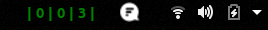
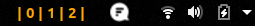
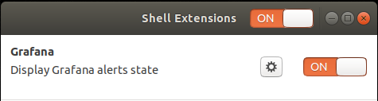

# grafana-gnome-shell-ext

Display alarm state

Three alarms OK

One alarm Pending, two OK

---

## Installation

Clone the repository to the gnome extensions directory

<code>
> git clone https://github.com/rodrigoap/grafana-gnome-shell-ext.git ~/local/share/gnome-shell/extensions/grafana@rodrigoap.com
</code>
  

Launch gnome shell extension preferences

<code>
> gnome-shell-extension-prefs
</code>
  

Click on the cog button

  

Add configuration parameters

**Grafana API URL**  
Complete URL to the API endpoint  
Required parameter  
Example: https://my-grafana-server/api/alerts

**Grafana API Key**  
Authorization API Key. [Grafana Authentication API](https://grafana.com/docs/grafana/latest/http_api/auth/)  
Optional parameter  

**Dashboards id**  
Comma separated list of dashboard IDs containing the alerts  
Required parameter  
Example: 33, 45

  

Turn on the extension with the ON/OFF selector

